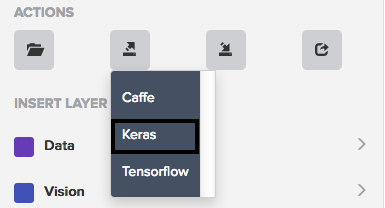

### Basics of Using the Exported Keras Model

We want to export our model for Keras from Fabrik.

1. First, select the 2nd button from the left in the Actions section of the sidebar.


2. A drop-down list should appear. Select Keras.
    * This should download a JSON file to your computer.


3. Rename the file to ```model.json```.

4. Load the model from the JSON file using the following code:
    ```
    from keras.models import model_from_json

    # Read and load the JSON file
    json_file = open('<path_to_file>/model.json', 'r')
    loaded_model_json = json_file.read()
    json_file.close()

    # Use Keras's built in model_from_json function to convert the JSON file to a model
    loaded_model = model_from_json(loaded_model_json)

    # Print a summary of the model to verify that the model loaded correctly
    print (loaded_model.summary())
    ```
### Example<sup>[1](https://machinelearningmastery.com/save-load-keras-deep-learning-models/)</sup>
1. [Export](http://fabrik.cloudcv.org/caffe/load?id=20171207035101pfjnz) this example Keras model (name it ```model.json```).

2. [Download](http://archive.ics.uci.edu/ml/machine-learning-databases/pima-indians-diabetes/pima-indians-diabetes.data) this data set that we will use to train on (name it ```pima-indians-diabetes.csv```).

3. Create a python file (name it ```kerasJSONLoader.py```) and insert the following code:
   ```
   from keras.models import model_from_json
   import numpy
   import os

   # Fix random seed to allow similar accuracy measures at the end
   numpy.random.seed(7)

   # Load pima indians dataset
   dataset = numpy.loadtxt('<path_to_file>/pima-indians-diabetes.csv', delimiter=',')

   # Split the dataset into input (X) and output (Y) variables
   X = dataset[:,0:8]
   Y = dataset[:,8]

   # Load the model from JSON file
   json_file = open('<path_to_file>/model.json', 'r')
   loaded_model_json = json_file.read()
   json_file.close()
   loaded_model = model_from_json(loaded_model_json)

   # Configure model for training and testing with accuracy evaluation
   loaded_model.compile(loss='binary_crossentropy', optimizer='adam', metrics=['accuracy'])

   # Train the model
   loaded_model.fit(X, Y, epochs=150, batch_size=10, verbose=0)

   # Evaluate the model
   scores = loaded_model.evaluate(X, Y, verbose=0)

   # Print final accuracy
   print("%s: %.2f%%" % (loaded_model.metrics_names[1], scores[1] * 100))
   ```
4. Then run the code in terminal.
   ```
   python <path_to_file>/kerasJSONLoader.py
   ```
You should be getting around 76-78% accuracy.

This code trains and evaluates the loaded model on the dataset.

